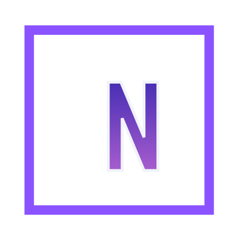

<div align="center">
  
  <h1>Nexus Chat</h1>
  <p>AI chat desktop app with rich data visualization, powered by LiteLLM</p>
  <p>
    <a href="LICENSE">GPL-3.0 License</a>
    · Copyright (c) 2026 ChloeWeever
  </p>
</div>

---

## Features

- **Any model** — connects to any LLM via [LiteLLM](https://docs.litellm.ai/) (OpenAI, Claude, Gemini, Ollama, and more)
- **Rich visualizations** — AI can render bar/line/area/pie charts, tables, metric cards, and progress bars inline in the conversation
- **File uploads** — attach images, PDFs, Word docs, Excel sheets, CSVs, and plain text/code files
- **Web search** — optional real-time search via Tavily, injected into the AI context
- **Skills** — define custom instruction sets and invoke them with `/skill-name` slash commands
- **Conversation history** — grouped by date, with per-conversation titles auto-generated from the first message
- **Dark / light / system theme**
- **Streaming responses** with a stop button

## Install & Run

```bash
npm install
npm run dev
```

### Build distributable

```bash
npm run package
```

Output: `dist/` — produces an NSIS installer on Windows and a DMG on macOS.

## Configuration

Open **Settings** (gear icon, bottom-left) and fill in:

| Field | Description |
|---|---|
| Base URL | Your LiteLLM proxy URL, e.g. `http://localhost:4000` |
| API Key | API key for the proxy (leave blank if not required) |
| Model | Model name, e.g. `gpt-4o-mini`, `claude-3-haiku`, `ollama/llama3` |

## Card Syntax

The built-in system prompt teaches the AI to render structured data cards using XML tags:

```xml
<card type="bar_chart" title="Monthly Revenue">
{"labels":["Jan","Feb","Mar","Apr"],"datasets":[{"label":"Sales","data":[1200,1800,1500,2100]}]}
</card>

<card type="line_chart" title="User Growth">
{"labels":["Week 1","Week 2","Week 3"],"datasets":[{"label":"Users","data":[500,720,1040]}]}
</card>

<card type="metric">
{"metrics":[{"label":"MRR","value":"$45K","change":"+12%","trend":"up"},{"label":"Churn","value":"2.3%","change":"-0.5%","trend":"down"}]}
</card>

<card type="table" title="Language Comparison">
{"columns":[{"key":"lang","label":"Language"},{"key":"perf","label":"Performance"},{"key":"use","label":"Use Case"}],
 "rows":[{"lang":"Rust","perf":"Excellent","use":"Systems"},{"lang":"Go","perf":"Very Good","use":"Services"}]}
</card>

<card type="progress" title="Q3 Goals">
{"items":[{"label":"Revenue","value":72},{"label":"Signups","value":55}]}
</card>
```

Supported card types: `bar_chart` · `line_chart` · `area_chart` · `pie_chart` · `table` · `metric` · `progress`

## Tech Stack

- [Electron](https://www.electronjs.org/) + [electron-vite](https://electron-vite.org/)
- [React](https://react.dev/) + [TypeScript](https://www.typescriptlang.org/)
- [Tailwind CSS](https://tailwindcss.com/) + [Radix UI](https://www.radix-ui.com/)
- [Recharts](https://recharts.org/) for data visualization
- [Zustand](https://zustand-demo.pmnd.rs/) for state management
